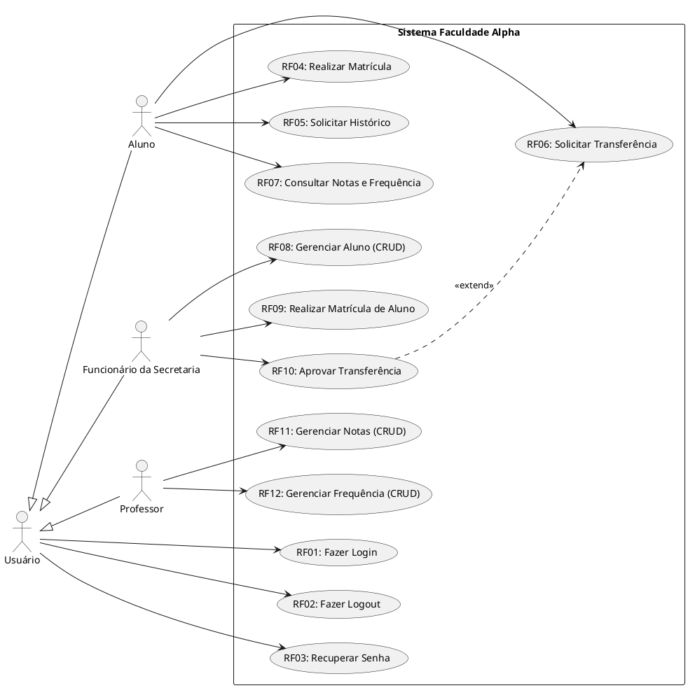
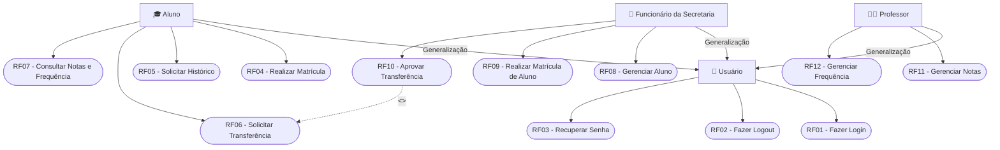

# Engenharia de Software 2 – Aula 06: Modelagem de Casos de Uso (Faculdade Alpha)

<p align="center">
  
  
  
</p>

---

## 📌 Contexto do Problema (Faculdade Alpha)[cite: 3]

A Faculdade Alpha está desenvolvendo uma aplicação acadêmica integrada para atender a diferentes perfis de usuários[cite: 3]:
* **Alunos**: Podem realizar matrícula pela aplicação, solicitar histórico escolar, solicitar transferência e consultar suas notas e frequências[cite: 3].
* **Funcionário da Secretaria**: Responsável por cadastrar, alterar, excluir ou consultar alunos (CRUD de Aluno), realizar matrícula de aluno e analisar/aprovar as solicitações de transferência iniciadas pelos alunos[cite: 3].
* **Professores**: Podem incluir, alterar, excluir ou consultar as notas e a frequência dos alunos (CRUD de Notas e Frequência)[cite: 3].
* **Ações Comuns**: Todos os usuários do sistema necessitam realizar autenticação (login), encerramento de sessão (logout) e recuperação de senha[cite: 3].

---

## 👥 1. Identificação dos Atores[cite: 3]

| Ator | Tipo | Descrição das Atribuições |
| :--- | :---: | :--- |
| **Usuário** | *Abstrato / Geral* | Ator genérico que representa qualquer pessoa autenticada no sistema. Centraliza os casos de uso comuns de acesso (`Fazer Login`, `Fazer Logout` e `Recuperar Senha`)[cite: 3]. |
| **Aluno** | *Especializado* | Ator do tipo estudante. Herda as funcionalidades de `Usuário` e realiza matrícula, solicita histórico, solicita transferência e consulta suas notas e frequências[cite: 3]. |
| **Funcionário da Secretaria** | *Especializado* | Ator administrativo. Herda as funcionalidades de `Usuário`, gerencia os dados cadastrais dos alunos, efetua matrículas e aprova solicitações de transferência[cite: 3]. |
| **Professor** | *Especializado* | Ator docente. Herda as funcionalidades de `Usuário` e possui acesso ao lançamento e gestão das notas e frequências das turmas[cite: 3]. |

---

## 📝 2. Lista de Requisitos Funcionais (RFs)[cite: 3]

**Requisitos Comuns (Gerais)**[cite: 3]
* **RF01 - Fazer Login**: O sistema deve permitir que qualquer usuário previamente cadastrado se autentique no sistema utilizando suas credenciais[cite: 3].
* **RF02 - Fazer Logout**: O sistema deve permitir que o usuário encerre com segurança a sua sessão ativa[cite: 3].
* **RF03 - Recuperar Senha**: O sistema deve permitir que o usuário solicite a redefinição de sua senha mediante confirmação de e-mail[cite: 3].

**Módulo Aluno**[cite: 3]
* **RF04 - Realizar Matrícula (pelo Aluno)**: O sistema deve permitir que o aluno efetue sua própria rematrícula/matrícula em disciplinas via aplicação[cite: 3].
* **RF05 - Solicitar Histórico Escolar**: O sistema deve permitir que o aluno solicite e emita seu histórico acadêmico[cite: 3].
* **RF06 - Solicitar Transferência**: O sistema deve permitir que o aluno abra uma solicitação formal de transferência de curso/instituição[cite: 3].
* **RF07 - Consultar Notas e Frequência**: O sistema deve permitir que o aluno visualize suas notas parciais/finais e seu percentual de frequência[cite: 3].

**Módulo Secretaria**[cite: 3]
* **RF08 - Gerenciar Aluno (CRUD)**: O sistema deve permitir que o funcionário da secretaria cadastre, altere, exclua e consulte registros de alunos[cite: 3].
* **RF09 - Realizar Matrícula de Aluno (pela Secretaria)**: O sistema deve permitir que a secretaria efetue ou regularize a matrícula de um aluno manualmente[cite: 3].
* **RF10 - Aprovar Transferência**: O sistema deve permitir que o funcionário da secretaria analise e aprove (ou recuse) as solicitações de transferência submetidas pelos alunos[cite: 3].

**Módulo Professor**[cite: 3]
* **RF11 - Gerenciar Notas (CRUD)**: O sistema deve permitir que o professor inclua, altere, exclua e consulte as notas dos alunos em suas disciplinas[cite: 3].
* **RF12 - Gerenciar Frequência (CRUD)**: O sistema deve permitir que o professor inclua, altere, exclua e consulte a chamada/frequência dos alunos[cite: 3].

---

## 📐 3. Diagrama de Casos de Uso (UML)[cite: 3]

### **PlantUML**



### **Mermaid Diagram**



---

## 🔍 4. Especificação Detalhada de Casos de Uso (Baixo Nível)[cite: 3]

### **Quadro 1. Especificação do Caso de Uso: Solicitar Transferência**[cite: 3]

| Campo | Descrição |
| :--- | :--- |
| **Caso de Uso** | `RF06: Solicitar Transferência`[cite: 3] |
| **Ator Principal** | Aluno[cite: 3] |
| **Ator Secundário** | Funcionário da Secretaria[cite: 3] |
| **Pré-condição** | O aluno deve estar logado no sistema e ter vínculo ativo[cite: 3]. |
| **Pós-condição** | A solicitação é registrada no sistema aguardando avaliação da secretaria[cite: 3]. |

| Ações do Ator | Ações do Sistema |
| :--- | :--- |
| **1.** O aluno acessa a opção "Solicitar Transferência". | **2.** O sistema exibe o formulário de transferência com os dados acadêmicos do aluno preenchidos. |
| **3.** O aluno preenche a justificativa, seleciona a instituição/curso de destino e confirma o envio. | **4.** O sistema valida o preenchimento dos campos obrigatórios. |
| | **5.** O sistema registra o pedido com status "Pendente de Aprovação" e notifica a secretaria. |

---

### **Quadro 2. Especificação do Caso de Uso: Aprovar Transferência**[cite: 3]

| Campo | Descrição |
| :--- | :--- |
| **Caso de Uso** | `RF10: Aprovar Transferência`[cite: 3] |
| **Ator Principal** | Funcionário da Secretaria[cite: 3] |
| **Ator Secundário** | Aluno[cite: 3] |
| **Pré-condição** | O funcionário da secretaria deve estar logado e deve haver solicitações pendentes[cite: 3]. |
| **Pós-condição** | A transferência é aprovada ou indeferida, e o status acadêmico do aluno é atualizado[cite: 3]. |

| Ações do Ator | Ações do Sistema |
| :--- | :--- |
| **1.** O funcionário acessa a opção "Aprovar Transferências". | **2.** O sistema lista todas as solicitações de transferência pendentes. |
| **3.** O funcionário seleciona uma solicitação para visualizar os detalhes. | **4.** O sistema exibe os detalhes do pedido e os documentos anexados. |
| **5.** O funcionário altera o status para "Aprovado" ou "Recusado", insere o parecer e confirma. | **6.** O sistema atualiza a situação do pedido, salva o registro e envia notificação ao aluno. |

---

## 📤 5. Forma de Entrega[cite: 3]

Subir esta atividade no repositório individual do GitHub na estrutura de pastas indicada[cite: 3]:

```text
[https://github.com/SEUUSUARIO/ES2N/Atividade6](https://github.com/SEUUSUARIO/ES2N/Atividade6)
```

---

## 📚 Referências[cite: 3]

* BOOCH, Grady et al. **The Unified Modeling Language User Guide**. Addison Wesley, 2005[cite: 3].
* MEDEIROS, Ernani. **Desenvolvendo Software com UML 2.0: Definitivo**. Makron Books, 2006[cite: 3].
* PRESSMAN, Roger S. **Engenharia de Software: Uma Abordagem Profissional**. 7ª ed. Porto Alegre: McGraw-Hill, 2011[cite: 3].
* SOMMERVILLE, Ian. **Engenharia de Software**. 10ª ed. São Paulo: Pearson, 2019[cite: 3].

---

## 👩‍🏫 Professora[cite: 3]

**Profª Mª Denilce Veloso**[cite: 3]  
📧 `denilce.veloso@fatec.sp.gov.br` | `denilce@gmail.com`[cite: 3]

---

## ✒️ Autores

**Aluno da FATEC Sorocaba**  
[](https://github.com/romerac)  
[](https://www.linkedin.com/in/viniciusromerac/)
