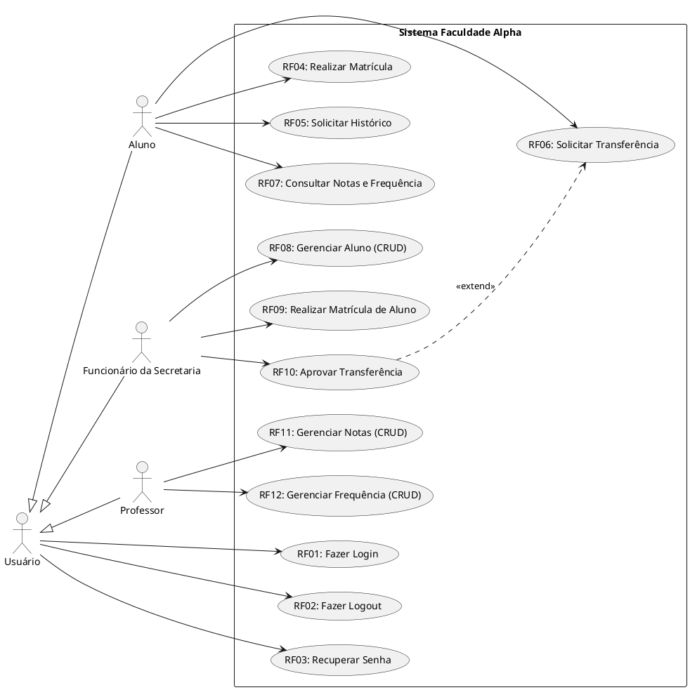
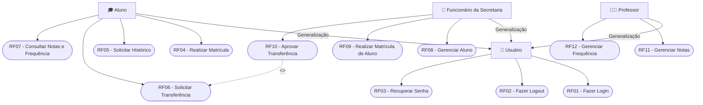

# Engenharia de Software 2 – Aula 06: Projeto, Implementação e Modelagem UML

  
  
  

Este material sintetiza o conteúdo ministrado na **Aula 6** da disciplina de **Engenharia de Software 2**, pela **Profª Mª Denilce Veloso**, abordando a transição da Engenharia de Requisitos para as fases de **Projeto e Implementação**, os conceitos essenciais de **Padrões de Projeto (Design Patterns)**, **Modelagem Arquitetural e de Contexto com UML** e a resolução da **Atividade 6 (Estudo de Caso - Faculdade Alpha)**.

---

## 🎯 Objetivo da Aula

Compreender e aplicar os conceitos fundamentais do projeto e implementação de software, focando em:

- **Atividades de Projeto e Implementação**: Compreender a relação não linear entre conceber a arquitetura e implementar o código executável.
- **Padrões de Projeto (Design Patterns)**: Conhecer modelos de solução reutilizáveis (*Singleton*, *Factory Method*, *Observer*, *Strategy*).
- **Arquitetura de Software**: Identificar modelos organizacionais (MVC, arquitetura em camadas, comunicação cliente-servidor/API REST).
- **Modelagem de Contexto e Interação**: Mapear as fronteiras do sistema e as integrações com APIs/serviços externos.
- **Casos de Uso UML**: Elaborar diagramas e especificações detalhadas de requisitos funcionais.

---

## 📋 Conteúdo Programático

### 1. Projeto e Implementação de Software
Apesar da diversidade de metodologias, o desenvolvimento envolve a transição da **Especificação** para as fases de **Projeto (Design)** e **Implementação (Codificação)**:
- **Projeto de Software**: Atividade criativa que identifica os componentes do sistema e seus relacionamentos com base nos requisitos.
- **Implementação**: Processo de tradução das decisões de projeto em código executável em uma linguagem de programação.
- **Processo Intercalado**: Na prática, projeto e implementação ocorrem simultaneamente e de forma iterativa.

---

### 2. Padrões de Projeto (Design Patterns)
Os padrões de projeto são modelos de solução comprovados para problemas recorrentes na arquitetura de software. Eles representam boas práticas, promovem a reutilização de código e facilitam a manutenção.

| Padrão | Problema que Ajuda a Resolver | Ideia Principal |
| :--- | :--- | :--- |
| **Singleton** | Necessidade de garantir que uma classe tenha apenas uma única instância em todo o sistema. | Controlar e centralizar o acesso a uma única instância global. |
| **Factory Method** | Evitar a criação direta de objetos acoplados no código principal. | Delegar a responsabilidade de instanciação para subclasses ou métodos fábrica. |
| **Observer** | Notificar múltiplos objetos quando o estado de um objeto principal for alterado. | Criar uma relação de "inscrição e notificação" entre objetos dependentes. |
| **Strategy** | Necessidade de alternar entre diferentes algoritmos ou regras de negócio em tempo de execução. | Encapsular cada algoritmo em classes separadas e permitir sua troca dinâmica. |

---

### 3. Fases do Projeto e Arquitetura de Software
O projeto de software divide-se em três etapas principais:
1. **Projeto Arquitetural**: Define a estrutura modular global (ex.: MVC, Microsserviços), interfaces e persitência em banco de dados (SQL/NoSQL).
2. **Projeto Detalhado**: Especifica as soluções internas de cada módulo (autenticação, regras de negócio, rotas).
3. **Implementação**: Codificação final nas linguagens e *frameworks* escolhidos (ex.: Next.js, Node.js, Express, MongoDB, MySQL).

---

### 4. Modelagem de Contexto e Interação com UML
- **Modelos de Contexto**: Definem os limites e o ambiente externo do sistema, mostrando quais subsistemas e APIs externas interagem com a aplicação (ex.: APIs de Pagamento, APIs de Transporte, Satélites).
- **Modelos de Interação**: Descrevem dinamicamente as trocas de mensagens e serviços entre o sistema e seus atores.
- **Ponte de Análise**: O modelo de Casos de Uso atua como ponto de intersecção entre a Especificação de Requisitos e o Modelo Conceitual/Classes de Análise.

---

## ✏️ Resolução dos Exercícios da Aula

### **Exercício 1 (Slide 28) - Análise de Diagrama UML**
* **Questão**: Considerando o Diagrama de Caso de Uso apresentado (Gerente Comercial, Gerente, Vendedor e Sistema de Contabilidade):
* **Resposta Correta**: **C) O ator "Vendedor" executa o fluxo do caso de uso "Avaliar Negócio"** (via relacionamento com os casos de uso que incluem `Avaliar Negócio`).

---

### **Exercício 2 (Slide 29) - Melhorias em Diagrama de Casos de Uso**
* **Problema Identificado**: O diagrama apresenta uma lista desorganizada de casos de uso com conexões redundantes entre `Aluno`, `Funcionário da FATEC` e `Empresa`.
* **Melhorias Necessárias**:
  1. Aplicar **Generalização/Especialização de Atores** (ex.: criar o ator genérico `Usuário` para encapsular `Fazer Login` e `Cadastrar Usuário`).
  2. Organizar os fluxos do sistema delimitando a **Fronteira do Sistema**.
  3. Evitar o cruzamento excessivo de linhas de associação.

---

### **Exercício 3 (Slide 30) - Erros em Relacionamentos de Casos de Uso**
* **Problema Identificado**: Há equívocos no uso de `<<include>>` e `<<extend>>`.
* **Correções**:
  - `Fazer Login` não deve ser encadeado como `<<include>>` direto do `Consulta Cardápio`, pois a consulta pode ser pública.
  - `Pagar Conta` e `Fazer Logout` foram encadeados sequencialmente como se fossem um fluxo de telas. O Diagrama de Casos de Uso descreve **funcionalidades**, não fluxo de navegação funcional linear.

---

## 📝 Resolução do Exercício Prático: Faculdade Alpha (Atividade 06)

### **1. Identificação dos Atores**

| Ator | Tipo | Descrição das Atribuições |
| :--- | :---: | :--- |
| **Usuário** | *Abstrato / Geral* | Representa qualquer pessoa autenticada. Centraliza os casos de uso comuns (`Fazer Login`, `Fazer Logout` e `Recuperar Senha`). |
| **Aluno** | *Especializado* | Herda de `Usuário`. Realiza matrícula, solicita histórico, solicita transferência e consulta notas e frequência. |
| **Funcionário da Secretaria** | *Especializado* | Herda de `Usuário`. Gerencia dados dos alunos (CRUD), efetua matrículas e analisa/aprova solicitações de transferência. |
| **Professor** | *Especializado* | Herda de `Usuário`. Gerencia notas e frequências dos alunos (CRUD). |

---

### **2. Lista de Requisitos Funcionais (RFs)**

**Requisitos Comuns**
* **RF01 - Fazer Login**: Permite a autenticação de usuários no sistema.
* **RF02 - Fazer Logout**: Permite o encerramento seguro da sessão.
* **RF03 - Recuperar Senha**: Permite redefinir a senha via e-mail cadastrado.

**Módulo Aluno**
* **RF04 - Realizar Matrícula (Aluno)**: Permite ao aluno efetuar sua matrícula via aplicação.
* **RF05 - Solicitar Histórico**: Permite ao aluno solicitar a emissão do histórico escolar.
* **RF06 - Solicitar Transferência**: Permite ao aluno abrir pedido formal de transferência.
* **RF07 - Consultar Notas e Frequência**: Permite ao aluno visualizar boletim e assiduidade.

**Módulo Secretaria**
* **RF08 - Gerenciar Aluno (CRUD)**: Permite à secretaria cadastrar, alterar, excluir e consultar alunos.
* **RF09 - Realizar Matrícula de Aluno (Secretaria)**: Permite à secretaria matricular alunos.
* **RF10 - Aprovar Transferência**: Permite à secretaria analisar e aprovar/recusar transferências.

**Módulo Professor**
* **RF11 - Gerenciar Notas (CRUD)**: Permite ao professor lançar e alterar notas.
* **RF12 - Gerenciar Frequência (CRUD)**: Permite ao professor lançar e alterar frequências.

---

### **3. Diagrama de Casos de Uso (PlantUML)**

---

### **4. Diagrama de Casos de Uso (Mermaid)**

## 📚 Referências

- BOOCH, Grady et al. **The Unified Modeling Language User Guide**. Addison Wesley, 2005.
- MEDEIROS, Ernani. **Desenvolvendo Software com UML 2.0: Definitivo**. Makron Books, 2006.
- PRESSMAN, Roger S. **Engenharia de Software: Uma Abordagem Profissional**. 7ª ed. Porto Alegre: McGraw-Hill, 2011.
- SOMMERVILLE, Ian. **Engenharia de Software**. 10ª ed. São Paulo: Pearson, 2019.

---

## 👩‍🏫 Professora

**Profª Mª Denilce Veloso**  
📧 `denilce.veloso@cps.sp.gov.br`

---

## ✒️ Autores

**Aluno da FATEC Sorocaba**  
  

